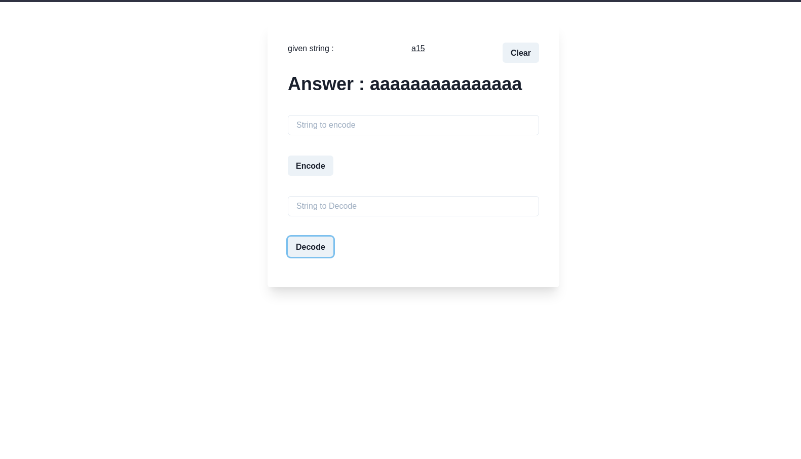
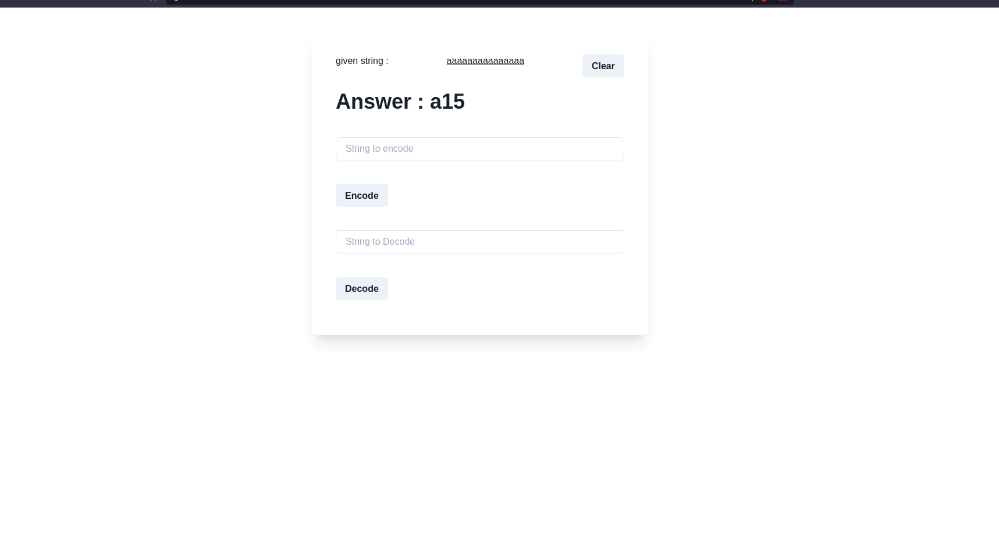

# Backend

## Explaination

### Encoding

- Take the input string and start iterating on the string
- for each alphabet check the consecutive occurence of the alphabet
- remove all the occurences except first one and add the total occurences after
- return string

### Decoding

- Take the input string and start iterating on the string
- for each alphabet check its total occurences and replace the number with the alphabet
- return string

## Endpoints

- Base_url/api/encode/{string to encode}
- Base_url/api/decode/{string to decode}

## libraries used

- express js to create a server

# Frontend

## Create-react-app

- created a top level app.js component for taking input for encoding and decoding and also displaying it.
- created 3 states (eInput, dInput, result)
- to fetch calls for encoding and decoding and setting the result

## libraries used

- chakra-ui for frontend ui components

## Screenshots

### Decode

### Encode

